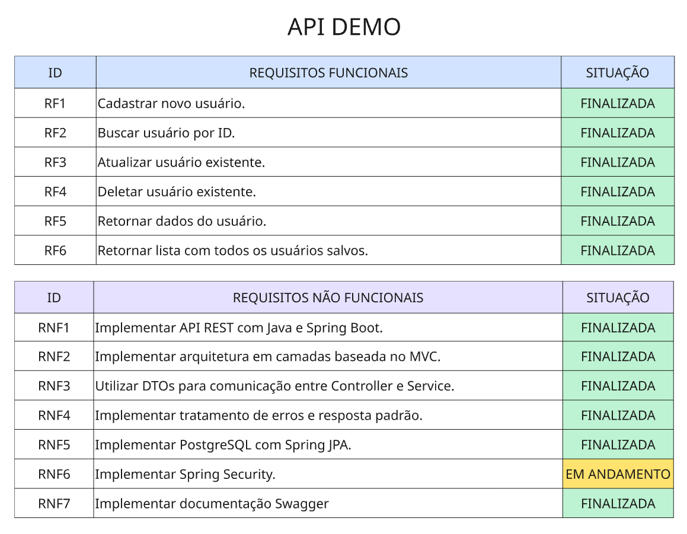
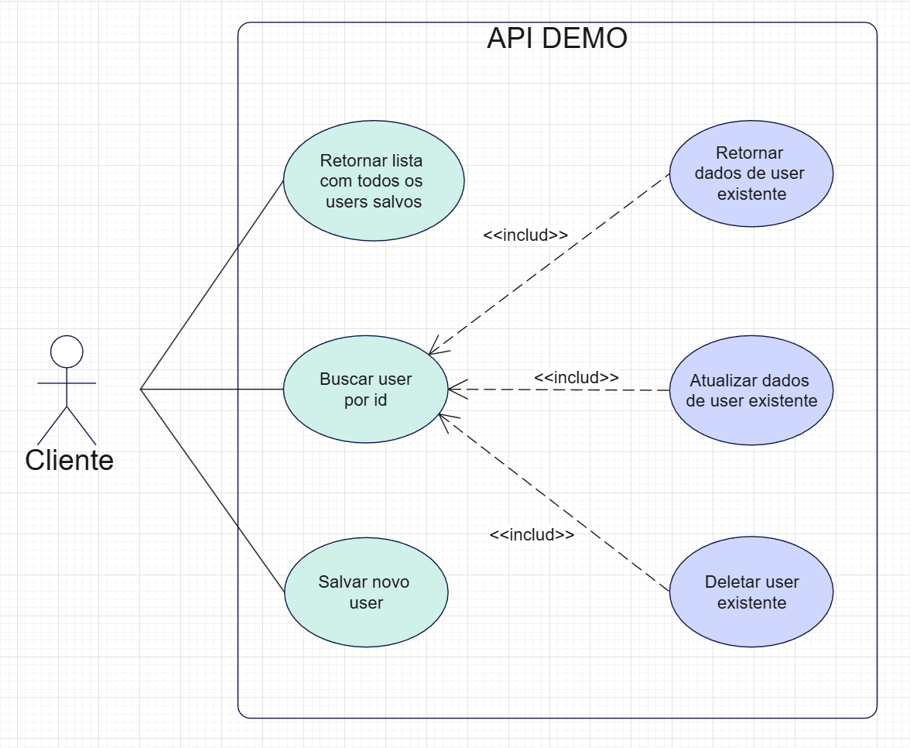
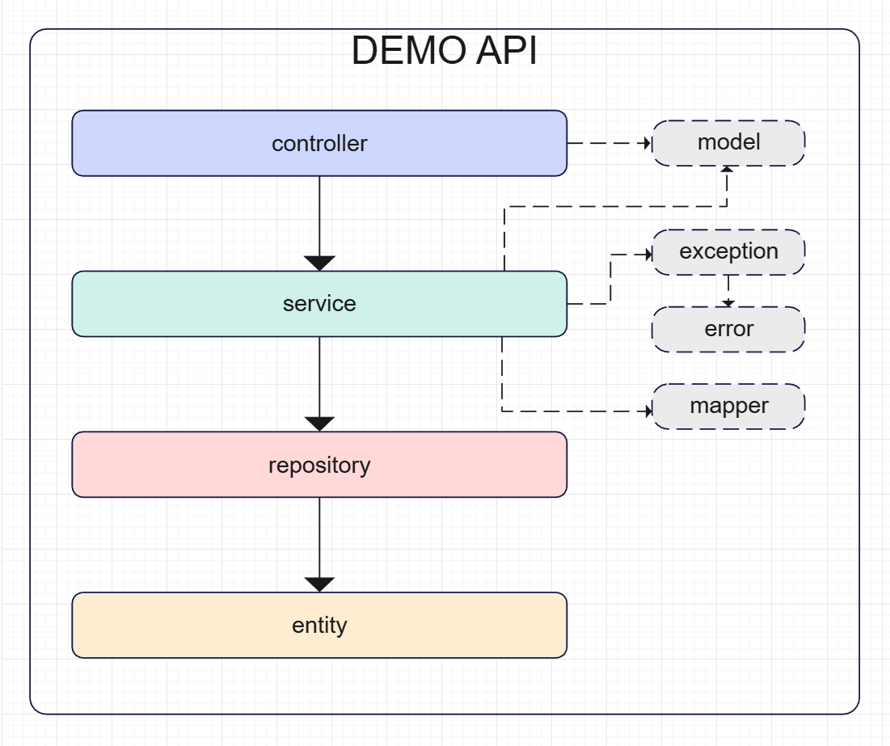

# API DEMO
 

## Apresentação

Olá, tudo bem?

Meu nome é Patrick e eu sou um desenvolvedor back-end Java no início da carreira, 
no momento estou estudando sobre APIs REST com operações CRUD.

Em caso de qualquer dúvida, sugestão ou correções, por favor entre em contato comigo pelo LinkedIn,
todo tipo de comentário será muito bem-vindo.

 

## Tecnologias usadas

- Sistema: Windows 11
- VS Code: 1.108.2
- Java: 21.0.9
- Maven: 3.9.11
- Spring Boot: 4.0.2
- Spring Web
- Spring MVC
 

## Funcionalidades

- GET /api/users: Retorna lista com todos os usuários salvos.
- GET /api/users/{id}: Retorna o usuário com id indicado.
- POST /api/users: Salva usuário.
- PUT /api/users/{id}: Atualiza usuário.
- DELETE /api/users/{id}: Deleta usuário.
 

## Objetivos futuros

Como esse projeto tem o propósito de estudos, optei por fazer sua evolução aos poucos com atualizações constantes,
com esse tópico servindo de checklist guia para modificações futuras.

 

- Construir Diagrama de Entidade-Relacionamento
- Implementar Spring JPA
- Integrar banco de dados PostgreSQL
- Implementar Spring Security
- Implementar Swagger
 

## Documentação
  
### Tabela de requisitos funcionais e não funcionais

 

### Diagrama de casos de uso

 

### Diagrama de camadas

 

## Dados do projeto

- Autor: Patrick Silva
- Versão: 1.0
- Última atualização: 29/01/2026
- Contato: www.linkedin.com/in/patrick-rocha-149244289
 