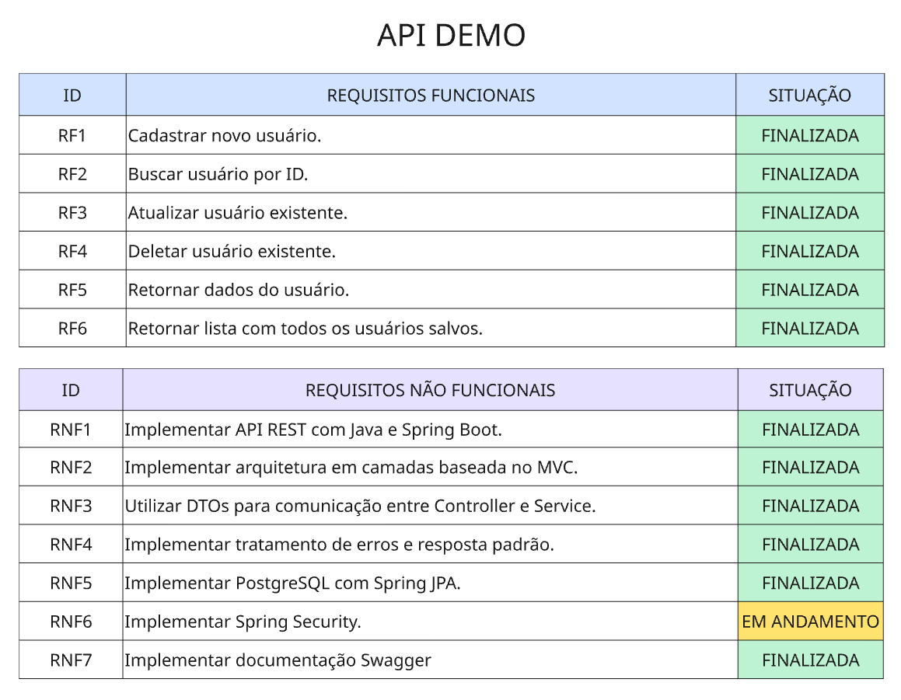
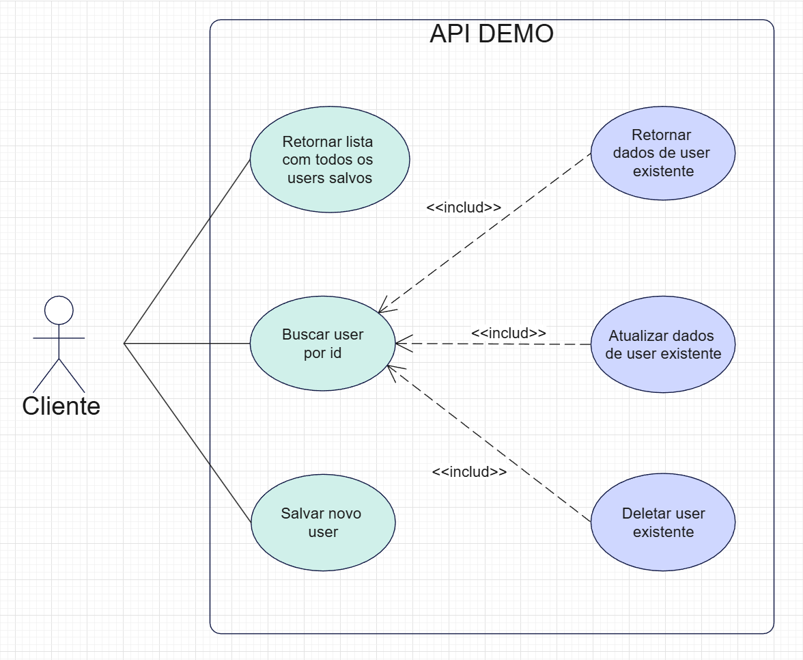
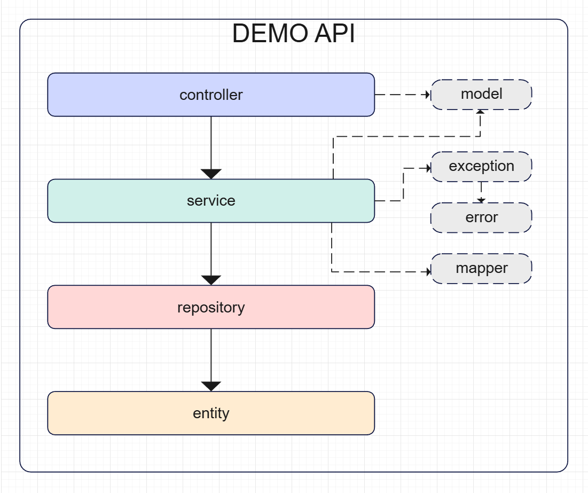

# API-CRUD-DEMO

<p>Esta é uma API REST com operações CRUD, desenvolvida com Java 21 e Spring Boot, 
aplicando arquitetura em camadas, persistência com Spring Data JPA e documentação com OpenAPI.</p>

<p>O objetivo deste projeto é consolidar conceitos relacionados ao desenvolvimento back-end, 
utilizando Java e o ecossistema Spring.</p>
<br>

## Tecnologias usadas

- Java 21
- Maven
- OpenAPI (Swagger)
- PostgreSQL
- Spring Boot
- Spring Data JPA (Hibernate)
<br>

## Endpoints
| Método | Endpoint | Descrição |
|----|----|----|
| GET | /user | Retorna a lista de usuários cadastrados. | 
| GET | /user/{id} | Retorna o usuário por ID. |
| POST | /user | Cria um novo usuário. | 
| PUT | /user/{id} | Atualiza usuário por ID. |
| DELETE | /user/{id} | Remove o usuário pelo ID. |
| Swagger JSON | /json | Documentação JSON da API (customizada). |
| Swagger UI | /doc | Interface gráfica da documentação da API (customizada). |
<br>

## Objetivos futuros

- Implementar Spring Data JPA. ✅
- Integrar persistência de dados com PostgreSQL. ✅
- Implementar documentação web com OpenAPI. ✅
- Implementar Spring Security.
<br>

## Como executar

### 1. Clonar o repositório
```git clone https://github.com/seuusuario/api-crud-demo.git```
<br>

### 2. Configurar o banco de dados
```CREATE DATABASE meu_banco;```
<br>

### 3. Configurar application-prod.properties
```spring.datasource.url = jdbc:postgresql://localhost:5432/meu_banco```  
```spring.datasource.username = username```  
```spring.datasource.password = password```  
```spring.jpa.hibernate.ddl-auto = create```  
<br>

### 4. Executar aplicação
```mvn spring-boot:run```  
<br>
<br>

## Documentação

### Tabela de requisitos funcionais e não funcionais

<br>

### Diagrama de casos de uso

<br>

### Diagrama de camadas

<br>
 
 ## Dados

- Autor: Patrick Rocha
- Versão: 1.2
- Última atualização: 27-02-2026
- Contato: www.linkedin.com/in/patrick-rocha-149244289
<br>

## Notas de atualização - versão 1.2
- Normalização de código para o idioma inglês.
- Implementação de comentários com JavaDoc.
- Implementação de documentação com OpenAPI.
- Alteração de nomes de classes e atributos.
- Criação do pacote swagger.
- Alterações no README.
<br>